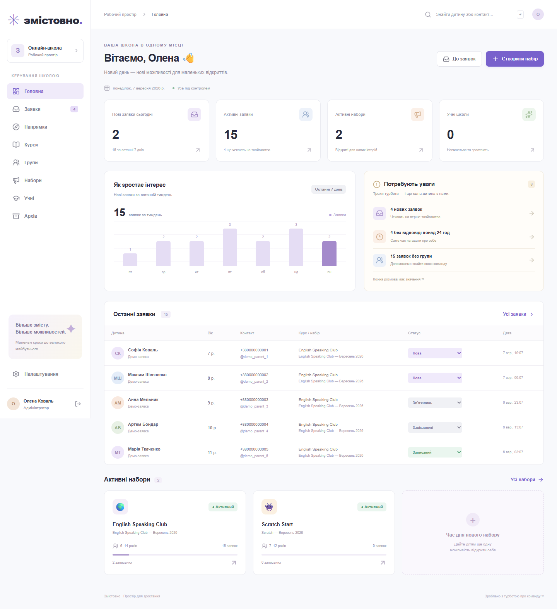

# Змістовно — CRM дитячої онлайн-школи

Працюючий MVP набору дітей: закритий кабінет команди, публічні реєстрації, заявки, навчальні групи й учні. Український адаптивний інтерфейс, світлий дизайн, картки, таблиці та доступні діалоги.



## Документація

- [Робоче розгортання](docs/PRODUCTION.md)
- [Інструкція для команди](docs/USER_GUIDE.md)
- [Telegram Control Center](docs/TELEGRAM.md)
- [Результати перевірок](docs/VALIDATION.md)
- [Правила розробки](CONTRIBUTING.md)

Репозиторій містить код, міграції та вигадані приклади. Робочі ключі, облікові дані й база не входять до репозиторію. Після клонування створіть власний `.env.local` за `.env.example`.

## Швидкий запуск із Supabase

Робочий запуск без демо: [PRODUCTION.md](docs/PRODUCTION.md). Інструкція для працівників: [USER_GUIDE.md](docs/USER_GUIDE.md).

Потрібні Node.js 22+ (рекомендовано 24 LTS), npm і проєкт Supabase. Docker не потрібен.

```bash
npm install
cp .env.example .env.local
```

У Windows PowerShell використайте `Copy-Item .env.example .env.local`.

1. Створіть проєкт на [supabase.com](https://supabase.com/dashboard), задайте пароль бази та виберіть регіон.
2. У Supabase SQL Editor виконайте **весь** файл `supabase/migrations/202609070001_crm.sql`. Він створює таблиці, індекси, зв’язки, RLS, тригери й функції. Застосовуйте міграції один раз у порядку імен; не запускайте повторно на існуючій схемі.
3. Для демонстраційних даних у тестовому проєкті виконайте `supabase/seed.sql` один раз. Це чотири напрямки, три курси, три набори, дві групи та 15 заявок. Усі демо-заявки позначені `is_test`. Контакти вигадані; не використовуйте їх для розсилок.
4. З Project Settings → API / API Keys скопіюйте URL та publishable key у `.env.local`:

```dotenv
NEXT_PUBLIC_SUPABASE_URL=https://YOUR_PROJECT.supabase.co
NEXT_PUBLIC_SUPABASE_PUBLISHABLE_KEY=YOUR_PUBLISHABLE_KEY
```

5. Створіть адміністратора за інструкцією нижче.
6. Запустіть:

```bash
npm run dev
```

Відкрийте [localhost:3000](http://localhost:3000). Без входу CRM перенаправляє на `/login`. Якщо Supabase не підключений, сторінка входу показує пояснення; доступ до CRM не відкривається автоматично.

Альтернатива SQL Editor — Supabase CLI: `supabase login`, `supabase link --project-ref YOUR_REF`, `supabase db push`. Для роботи з віддаленим проєктом Docker не потрібен. Seed застосовується окремо й лише в тестовому середовищі.

## Перший admin

Тимчасово додайте у `.env.local`:

```dotenv
SUPABASE_SERVICE_ROLE_KEY=YOUR_SERVER_ONLY_SERVICE_ROLE_KEY
ADMIN_EMAIL=your-real-email@example.com
ADMIN_PASSWORD=YOUR_UNIQUE_PASSWORD_AT_LEAST_12_CHARACTERS
ADMIN_NAME=Ваше ім’я
```

```bash
npm run admin
```

Скрипт створить підтвердженого користувача Supabase Auth і профіль admin. Якщо профіль створити не вдалося, новий Auth user видаляється, щоб не залишити незавершений обліковий запис. Скрипт не змінює вже існуючі облікові записи.

Після створення видаліть `ADMIN_PASSWORD` з `.env.local`. `SUPABASE_SERVICE_ROLE_KEY` залиште для серверної роботи Telegram. Не додавайте ці секрети до Git або змінних з префіксом `NEXT_PUBLIC_`.

Новий менеджер: створіть користувача в Supabase Authentication → Users, потім у SQL Editor додайте профіль:

```sql
insert into public.profiles (id, full_name, role)
values ('UUID_КОРИСТУВАЧА_З_AUTH', 'Ім’я менеджера', 'manager');
```

Самостійної реєстрації співробітників у застосунку немає. Обліковий запис без профілю не має доступу до даних. Admin змінює ролі інших учасників у «Налаштуваннях»; власна роль захищена від випадкового зняття в інтерфейсі. Для відновлення пароля скористайтеся засобами Supabase Auth.

## Локальна демонстрація без Supabase

```bash
npm run demo
```

Команда запускає Next.js лише на `127.0.0.1`, друкує локальні логін та випадковий пароль і використовує PGlite — PostgreSQL у WebAssembly. Дані зберігаються у `.test-db/demo`; при перезапуску вони залишаються. Це окремий локальний адаптер для демонстрації/тестування, не заміна Supabase Auth у робочому середовищі. Режим примусово вимкнений при `NODE_ENV=production`.

У цьому робочому просторі також завантажений перевірений portable Node.js у `.tools/node-v24.20.0-win-x64`. Якщо Node.js не встановлений глобально, у PowerShell перед командами виконайте:

```powershell
$env:PATH = "$PWD\.tools\node-v24.20.0-win-x64;$env:PATH"
```

`.tools` не входить до репозиторію та не потрібна на інших комп’ютерах зі встановленим Node.js.

## Основний сценарій

1. Увійдіть у кабінет. Створіть напрямок → курс → набір. Виберіть статус «Активний».
2. На сторінці набору налаштуйте поля форми, скопіюйте публічне посилання або натисніть «Відкрити форму». Telegram/Zoom/інші посилання додаються в панелі «Корисні посилання» після створення запису.
3. Батьки відкривають `/register/{slug}` без входу, вказують дані та надсилають заявку.
4. У «Заявках» знайдіть дитину, відкрийте картку, змініть статус, призначте менеджера та додайте примітку.
5. Створіть групу відповідного курсу та віку. У картці заявки оберіть її. Несумісні групи не пропонуються; база також перевіряє сумісність.
6. Установіть «Записаний» → «Створити учня». Заявка залишається, учень створюється лише один раз. Якщо групу вже призначено, учень одразу потрапляє до її списку. Подальша зміна групи заявки синхронізує це призначення.

Публічне посилання демо-набору: `/register/english-speaking-club-september-2026`.

## Що реалізовано

- Dashboard: сьогодні, сім днів, активні заявки/набори, учні, черга уваги, останні заявки, графік і картки наборів. Дати й розклад — за Києвом.
- Напрямки та курси: створення, редагування, активність, вікові межі, вкладена структура.
- Набори: п’ять статусів, унікальний slug, дати, опис, внутрішня примітка, посилання та архів. Публічна форма доступна лише для активного набору в межах дат, активного курсу та напрямку.
- Конструктор: видимість, обов’язковість, підпис, placeholder і числовий порядок кожного з семи полів. Повний drag-and-drop не входить до MVP. Вимкнені поля ігноруються сервером.
- Заявки: дев’ять статусів, пошук, фільтри за напрямком, курсом, набором, віком, статусом, датами й менеджером; пагінація, картка, контакти, історія, примітки, позначка тестового запису.
- Можливі дублікати: збіг нормалізованого телефону, Telegram або повного імені; не блокують нові заявки. Схожі записи доступні з картки.
- Групи та учні: курс, вік, викладач, день/час, посилання, склад і дата додавання.
- Масові дії: статус, сумісна група, архів, видалення з підтвердженням, CSV обраних або відфільтрованих заявок.
- Очищення набору: видалення тестових, архівація всіх або всіх незаписаних; перед дією показується точна кількість. Вибіркове видалення — через checkbox у таблиці.
- CSV: усі/відфільтровані/обрані заявки, конкретний набір, учні та склад групи; UTF-8 BOM, екранування та захист від формул електронних таблиць.
- Архів: відновлення заявок, закритих/архівних наборів. Набір відновлюється призупиненим — публічну реєстрацію потрібно активувати свідомо. Заявки архівного набору видимі в архіві; спочатку відновіть сам набір, щоб повернути їх у робочу чергу. Видалення набору з заявками блокує зовнішній ключ.
- Аудит: дії зі структурою школи, набором, заявками, примітками, полями, групами, учнями та посиланнями. Системні події не мають менеджера-автора.

## Архітектура та доступ

```text
src/app/                 App Router, server actions, login, public register
src/components/          Shell, спільні компоненти, shadcn/Radix UI
src/features/            auth, dashboard, catalog, campaigns, registration,
                         leads, settings, telegram
src/services/            auth, database adapter, CSV export
src/lib/                 Supabase SSR, Zod, utilities, local test database
src/types/               Типи сутностей CRM
supabase/migrations/     Реляційна схема, RLS, RPC, тригери, індекси
supabase/seed.sql         Вигадані демо-дані
tests/                   Тести PostgreSQL/RLS/валідації та Playwright E2E
```

Робочий стек: Next.js App Router, TypeScript, Tailwind CSS, shadcn-style компоненти на Radix і CVA, Lucide, Sonner, React Hook Form, Zod, Supabase/PostgreSQL, Supabase Auth. Залежності зафіксовані у lockfile. ESLint 9 збережений для сумісності плагінів офіційного Next.js-конфігу.

Серверні дії перевіряють користувача і профіль, дані перевіряє Zod; RLS працює незалежно від інтерфейсу. `anon` не має доступу до таблиць. Публічні RPC повертають лише безпечну проєкцію активного набору та приймають реєстрацію без читання заявок. Статус, менеджер, група, тестові/архівні прапорці з публічного запиту ігноруються. UUID надсилання має unique constraint: повтор того самого запиту не створює другий lead. Зміни статусу й аудит пишуться тригерами.

Admin керує ролями; admin/manager працюють зі всіма операційними модулями, включно зі створенням напрямків і курсів відповідно до описаного сценарію менеджера. Teacher/call_center зарезервовані, але поки не мають доступу. JSONB використано для передачі/валідації даних RPC, а не для зберігання CRM замість таблиць.

MVP завантажує робочий набір даних на сервері, посторінково з Supabase (без обрізання на 1000 записів), і фільтрує таблицю в браузері. Для великих обсягів наступним кроком буде серверна пагінація/пошук. Список заявок оновлюється раз на 30 секунд і має кнопку оновлення. Це не realtime-підписка. Оплати, відвідування, календар та інтеграція Google Sheets не реалізовані.

Telegram Control Center підтримує групи/канали, створення груп через акаунт власника, публікації через бота, медіа, preview, шаблони, чергу відкладених повідомлень, історію та заявки на вступ. Налаштування, міграція, секрети й планувальник описані в [docs/TELEGRAM.md](docs/TELEGRAM.md). У локальному демо Telegram явно імітується без реальних надсилань; AI та inbox залишаються майбутніми модулями.

## Перевірки

```bash
npm run typecheck
npm run lint
npm test
npm run test:e2e
npm run build
```

`npm test` застосовує реальну SQL-міграцію до ізольованої PGlite бази та перевіряє RLS через ролі `anon`/`authenticated`, приватність, обов’язкові поля, idempotency, групи, учнів, історію й FK. Ці тести не змінюють Supabase.

Playwright використовує встановлений Chrome і локальний тестовий адаптер. Можна вибрати Edge: `PLAYWRIGHT_CHANNEL=msedge`. Тести запускають власний dev server на `127.0.0.1:3000`; цей порт має бути вільним. Для браузерних тестів використовується окрема `.test-db/e2e`, тому тестові записи не забруднюють демо. Через спільний порт запускайте тести без паралельного локального демо. Секрети з конфігу діють лише в локальному тестовому режимі. Продукційна збірка зберігається у `.next`, тестова — у `.next-test`.

Тести локальної Auth-імітації не замінюють перевірку входу до вашого Supabase-проєкту: після налаштування URL/key/admin повторіть основний сценарій з реальним Supabase Auth.

## Розгортання на Vercel

1. Додайте код до свого Git-репозиторію та імпортуйте його у Vercel як Next.js project.
2. У Vercel Environment Variables задайте `NEXT_PUBLIC_SUPABASE_URL` та `NEXT_PUBLIC_SUPABASE_PUBLISHABLE_KEY` робочого проєкту Supabase. Для Telegram додайте серверні секрети за [інструкцією](docs/TELEGRAM.md).
3. Застосуйте обидві SQL-міграції послідовно в Supabase до першого запуску. Створіть admin локальним скриптом. Для Telegram потрібен серверний service role key; він ніколи не передається браузеру.
4. У Supabase Authentication → URL Configuration встановіть Site URL на HTTPS-домен застосунку. Налаштуйте дозволені redirect URLs, якщо використовуєте поштове відновлення пароля в Supabase.
5. Запустіть deployment. Build command: `npm run build`. Не задавайте `CRM_TEST_*` у Vercel.
6. Перевірте `/login`, створення набору, анонімну форму в іншому браузері, появу заявки та її обробку.

Довідка: [Next.js installation](https://nextjs.org/docs/app/getting-started/installation), [Supabase SSR](https://supabase.com/docs/guides/auth/server-side/creating-a-client), [Supabase RLS](https://supabase.com/docs/guides/database/postgres/row-level-security).
